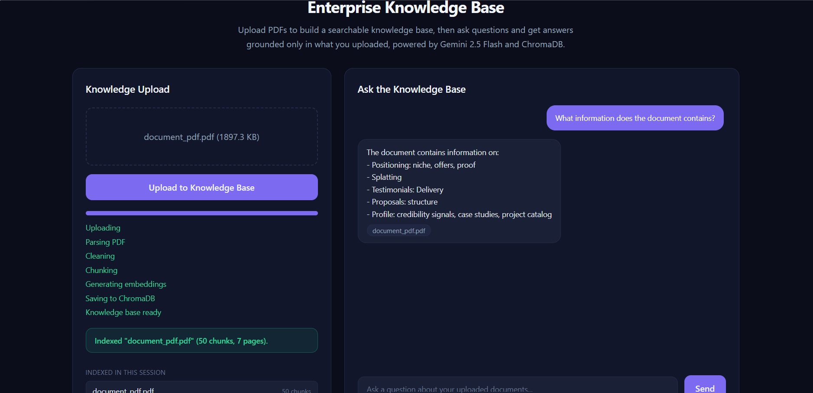

# Enterprise Knowledge Base (RAG Chatbot)

An enterprise-style Retrieval-Augmented Generation (RAG) chatbot. Upload PDF documents, they get parsed, cleaned, chunked, embedded, and indexed into ChromaDB. Then ask questions in a chat interface and get answers generated by Gemini 2.5 Flash, grounded only in the content you uploaded.

**Stack:** NestJS, TypeScript, Gemini 2.5 Flash, Gemini Embeddings, ChromaDB, Tailwind CSS, vanilla JavaScript



---

## What it does

**Uploading a PDF** (`POST /knowledge/upload`):
1. Accepts a PDF upload
2. Extracts raw text and page count
3. Cleans the text (whitespace, line breaks, control characters)
4. Converts it to Markdown (headings become chunk boundaries)
5. Splits it into chunks (800 characters, 150 character overlap, sentence-safe, heading-aware)
6. Generates a Gemini embedding for every chunk
7. Stores each chunk's text, embedding, and metadata (file name, page count, upload timestamp, chunk id, heading) in ChromaDB

**Asking a question** (`POST /chat`):
1. Validates the question is a non-empty string
2. Embeds the question with the same Gemini embedding model
3. Searches ChromaDB for the 5 most similar chunks
4. Assembles those chunks into one context block
5. Sends the context and question to Gemini 2.5 Flash, with a system prompt that forbids answering from outside knowledge
6. Returns `{ answer, sources }`, where `sources` lists which uploaded file(s) the answer was grounded in

---

## Project structure

```
rag-ai-knowledge-base/
├── public/                              Frontend (served as static files)
│   ├── index.html                        Split-pane dashboard (upload left, chat right)
│   ├── styles.css
│   └── app.js
├── src/
│   ├── main.ts                           Application entry point
│   ├── app.module.ts                      Root module
│   ├── config/
│   │   └── configuration.ts               Typed environment configuration
│   ├── common/                            Shared, framework-agnostic pipeline pieces
│   │   ├── pdf/pdf-parser.util.ts           PDF to raw text
│   │   ├── text/text-cleaner.util.ts        Whitespace/artifact cleanup
│   │   ├── markdown/markdown-converter.util.ts  Text to Markdown
│   │   └── chunking/chunking.service.ts     Recursive, overlapping, heading-aware chunking
│   ├── gemini/                            Everything that talks to the Gemini API
│   │   ├── gemini-embedding.service.ts      Text to embedding vector
│   │   ├── gemini-generation.service.ts     Context + question to answer
│   │   └── gemini.module.ts
│   ├── vector-store/                      The swappable vector database layer
│   │   ├── vector-store.port.ts             The interface the rest of the app depends on
│   │   ├── chroma-vector-store.service.ts   ChromaDB implementation of that interface
│   │   └── vector-store.module.ts
│   ├── prompt/
│   │   └── prompt-builder.service.ts        Assembles retrieved chunks into context
│   ├── knowledge/                         Upload feature
│   │   ├── knowledge.controller.ts          POST /knowledge/upload
│   │   ├── knowledge.service.ts             Ingestion pipeline orchestrator
│   │   ├── knowledge.module.ts
│   │   └── dto/upload-response.dto.ts
│   └── chat/                              Chat feature
│       ├── chat.controller.ts               POST /chat
│       ├── chat.service.ts                  RAG orchestrator (embed, search, generate)
│       ├── chat.module.ts
│       └── dto/
│           ├── chat-request.dto.ts           Validates the question
│           └── chat-response.dto.ts
├── .env.example
├── package.json
├── tsconfig.json
└── nest-cli.json
```

---

## Setup

### 1. Install dependencies

```bash
npm install
```

### 2. Install and start ChromaDB

ChromaDB needs to be running as a separate local server before you start the app. The Node client talks to it over HTTP.

```bash
# Installs the chroma CLI (comes bundled with the chromadb package)
npx chroma run --path ./chroma-data --port 8000
```

Leave this running in its own terminal. It stores its data in the `./chroma-data` folder (already excluded via `.gitignore`), so restarting it later will pick up where you left off.

### 3. Configure environment variables

```bash
cp .env.example .env
```

`.env`:
```
PORT=3000
GEMINI_API_KEY=YOUR_API_KEY
GEMINI_CHAT_MODEL=gemini-2.5-flash
GEMINI_EMBEDDING_MODEL=gemini-embedding-001
EMBEDDING_DIMENSIONS=768
CHROMA_URL=http://localhost:8000
CHROMA_COLLECTION_NAME=knowledge_base
MAX_FILE_SIZE_BYTES=10485760
CHUNK_SIZE=800
CHUNK_OVERLAP=150
RETRIEVAL_TOP_K=5
```

### 4. Run the NestJS app

```bash
npm run start:dev
```

### 5. Open the app

Go to `http://localhost:3000` in a browser.

### 6. Test PDF upload

On the left panel, drag a PDF in (or click to choose one), then click "Upload to Knowledge Base." Watch the progress bar move through Uploading, Parsing, Cleaning, Chunking, Generating Embeddings, and Saving to ChromaDB, then see a confirmation with the chunk count.

### 7. Test chat

On the right panel, type a question about the document you just uploaded and press Enter (or click Send). You should see the retrieval stages animate (Searching, Building Context, Thinking, Generating Answer), then a grounded answer with the source file name shown as a tag underneath it. Asking something unrelated to the uploaded content should get back: "I couldn't find this information in the uploaded knowledge base."

No Postman or Thunder Client needed. The browser is the entire test surface.

---

## Architecture diagram

```
                         Browser (Tailwind + vanilla JS dashboard)
                          |                              |
                 POST /knowledge/upload            POST /chat
                          |                              |
                          v                              v
              KnowledgeController               ChatController
                          |                              |
                          v                              v
               KnowledgeService                    ChatService
        (ingestion orchestrator)              (RAG orchestrator)
                          |                              |
     -----------------------------------      -------------------------
     |          |            |        |        |            |         |
     v          v            v        v        v            v         v
  pdf-parser  text-      markdown  Chunking  Gemini      VectorStore  Gemini
  .util       cleaner    -converter Service  Embedding   (query)      Generation
              .util      .util               Service                  Service
                                                 |            ^            ^
                                                 v            |            |
                                          VectorStorePort ----+            |
                                                 |                         |
                                                 v                         |
                                         ChromaVectorStoreService          |
                                                 |                         |
                                                 v                         |
                                             ChromaDB                     |
                                       (embeddings + text + metadata)     |
                                                                          |
                                          PromptBuilderService ----------+
                                        (assembles retrieved chunks
                                         into one context string)
```

Both feature modules (Knowledge, Chat) depend on the same shared Gemini and vector-store modules, but not on each other. Uploading a document and asking a question are independent operations that only share the embedding model and the ChromaDB collection.

---

### What each file does

- `main.ts`: creates the application, enables CORS, applies a global validation pipe (this is what enforces "reject empty prompts" at the request boundary), and starts the server.
- `app.module.ts`: the root module. Loads environment variables, serves the dashboard, and imports the shared infrastructure modules (Gemini, vector store) plus the two feature modules (Knowledge, Chat).
- `config/configuration.ts`: converts raw environment variable strings into a typed config object, covering chunk size, overlap, retrieval top-K, embedding dimensions, and every other tunable value.
- `common/pdf/pdf-parser.util.ts`: extracts raw text and page count from the uploaded file, and returns a clean error if the file cannot be parsed.
- `common/text/text-cleaner.util.ts`: normalizes line breaks and tabs, strips control characters, collapses duplicate whitespace.
- `common/markdown/markdown-converter.util.ts`: converts cleaned text into Markdown, using heuristics for headings and bullet lists.
- `common/chunking/chunking.service.ts`: the recursive, overlapping, heading-aware, sentence-safe chunking strategy described above.
- `gemini/gemini-embedding.service.ts`: the only file that knows how to call Gemini's embedding model. Everything else calls `embedText(text)` and gets back a plain number array.
- `gemini/gemini-generation.service.ts`: the only file that knows how to call Gemini's chat model. Owns the anti-hallucination system prompt.
- `vector-store/vector-store.port.ts`: the interface (`VectorStorePort`) that the rest of the app depends on, instead of depending on ChromaDB directly. This is the seam a future Pinecone or hybrid-search adapter would plug into.
- `vector-store/chroma-vector-store.service.ts`: the ChromaDB implementation of that interface. The only file in the app that imports the `chromadb` package.
- `prompt/prompt-builder.service.ts`: turns a list of retrieved chunks into the single context string sent to Gemini, and extracts the list of source file names for the response.
- `knowledge/knowledge.service.ts`: orchestrates the upload pipeline (parse, clean, convert, chunk, embed, store). Contains no PDF-, chunking-, or Gemini-specific logic itself.
- `chat/chat.service.ts`: orchestrates the RAG flow (embed question, search, build context, generate answer). This is the RAG orchestrator the rest of the system is built around.
- `chat/dto/chat-request.dto.ts`: the `class-validator` rules that reject empty or excessively long questions before the request reaches any service.

---

## Known simplifications 

- **Embeddings are generated one chunk at a time**, in a loop, rather than batched into a single API call. A production version would batch requests to reduce latency and API call count.
- **Overlap is measured in characters of trailing sentences**, not tokens, and a single sentence longer than the chunk size is kept whole rather than being cut mid-sentence. A reasonable trade-off, not a token-perfect implementation.
- **Retrieval is pure vector similarity search**, with no keyword/BM25 component and no reranking step. Hybrid search and reranking are the next things being added.
- **No conversation memory.** Each question is answered independently; the chat endpoint does not use prior turns as context.


## Error handling

| Situation | Response |
|---|---|
| No file attached, empty file, non-PDF, or file over the size limit | 400 Bad Request |
| Corrupted or unparsable PDF, or a PDF with no extractable text | 400 Bad Request |
| Empty or excessively long chat question | 400 Bad Request |
| Missing or invalid Gemini API key | 500 Internal Server Error |
| ChromaDB unreachable | 500 Internal Server Error, with a message pointing at ChromaDB specifically |

This was verified with real requests: PDF parsing, cleaning, Markdown conversion, and chunking were all confirmed correct against a real multi-section PDF; the upload pipeline was confirmed to reach the real Gemini embedding endpoint; and the ChromaDB storage and retrieval logic (`upsert` and `query`, through the actual `ChromaVectorStoreService` class) was confirmed correct end to end using test vectors, including that the closest stored vector to a query is returned first with the correct metadata attached.

## Debugging notes

**Issue: retrieval failed on obviously relevant content, even with exact keyword matches.**
-Root cause was two related gaps in the embedding calls: no `taskType` was specified (Gemini's embedding model produces meaningfully better retrieval when told whether text is being indexed as a document or asked as a query), and `gemini-embedding-001` does not auto-normalize vectors at reduced output dimensionality (768 here), which distorted similarity scoring in ChromaDB. Fixed by setting `taskType: RETRIEVAL_DOCUMENT` for indexed chunks, `taskType: RETRIEVAL_QUERY` for questions, and manually L2-normalizing every embedding before storage or search.

-A follow-up attempt to also embed each chunk's section heading alongside its content was tested and reverted: for this document's very short chunks, prefixing a heading measurably diluted the embedding's focus rather than sharpening it, and reduced retrieval quality on previously-working queries. Left as a reminder that heading-context works better for larger chunks than the small ones this document produced.
